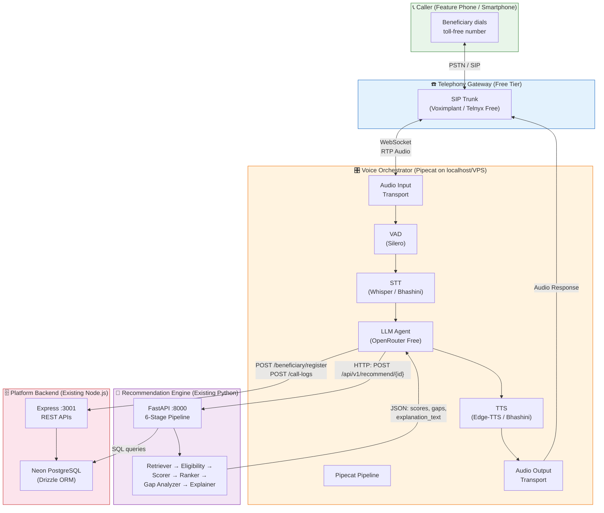
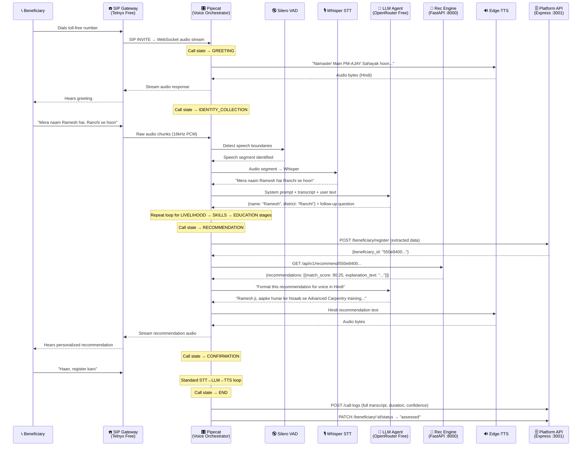
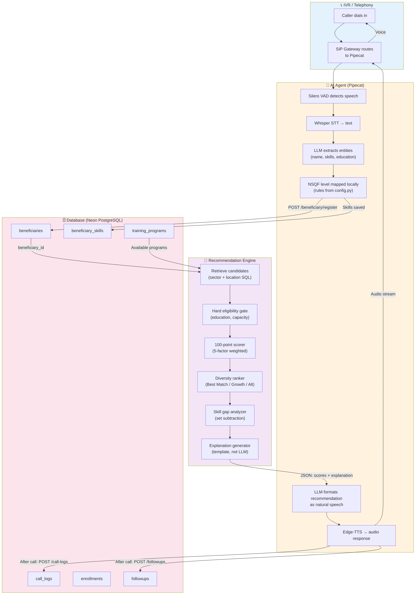

# 🎙️ VaniSetu — Voice AI Agent System Architecture
## $0-Cost Real-Time Voice Pipeline for PM-AJAY GIA Livelihood Mapping

> **Prepared for:** VaniSetu Team — Slide Deck / Presentation
> **Date:** September 28, 2026
> **Constraint:** Total cost = $0 (free tiers, open-source, free API credits only)

---

## 📌 Executive Summary

VaniSetu's Voice AI Agent is the missing **Layer 1** — the real-time telephony pipeline that lets a beneficiary call a number, speak in Hindi or a regional language, and receive a personalized NSQF training recommendation within a single phone call.

**What already exists:**
- ✅ **Recommendation Engine** — Python FastAPI microservice, 6-stage deterministic pipeline (100-point scorer, diversity filter, explainer)
- ✅ **Platform Backend** — Node.js Express + Neon PostgreSQL + Drizzle ORM (all CRUD APIs, analytics, auth)

**What this architecture designs:**
- 📞 **Voice Orchestration** — Real-time audio streaming, turn-taking, and pipeline coordination
- 🎙️ **STT/TTS Pipeline** — Speech recognition and synthesis in Indian languages
- 🧠 **LLM Conversation Agent** — Guided data extraction via free-tier models
- 🔗 **Recommendation Handoff** — Programmatic bridge between AI agent and scoring engine
- 🗄️ **State Management** — When and how call state, transcripts, and results hit the database

---

## 🏗️ High-Level Architecture



---

## 📞 Telephony / Voice Pipeline — Exact Data Flow

### The Complete Loop



---

## 🛠️ Finalized Free / Open-Source Tech Stack

### Voice Orchestration

| Component | Technology | Cost | Why This? |
|-----------|-----------|------|-----------|
| **Voice Pipeline Framework** | [**Pipecat**](https://github.com/pipecat-ai/pipecat) (Python, open-source) | $0 | Python-native (matches our engine), built-in STT/TTS/LLM pipeline abstractions, SIP transport support, VAD integration, turn-taking. Our recommendation engine is already Python — zero-friction integration. |
| **Voice Activity Detection** | **Silero VAD** (via Pipecat) | $0 | State-of-the-art open-source VAD, handles silence detection, interruption, and endpointing. Bundled with Pipecat. |
| **Audio Transport** | **Pipecat SIP/WebSocket Transport** | $0 | Native SIP and WebSocket transports for connecting to telephony gateways. |

### Speech-to-Text (STT)

| Option | Technology | Cost | Tradeoff |
|--------|-----------|------|----------|
| **Primary** | **Whisper (local, `whisper-small` or `whisper-medium`)** | $0 | Run locally via `faster-whisper`. Good Hindi/multilingual support. ~500MB VRAM for `small`. Pipecat has a built-in Whisper service. |
| **Fallback** | **Bhashini API** (Government of India) | $0 | Free government platform, 22+ Indian languages including dialects. Requires API key registration (free). Higher latency (network round-trip). |

> [!TIP]
> Start with `faster-whisper` (small model) locally. It handles Hindi well and has zero ongoing cost. Fall back to Bhashini for languages Whisper struggles with (Sadri, Odia dialects).

### LLM (Conversation Agent)

| Component | Technology | Cost | Details |
|-----------|-----------|------|---------|
| **Conversation LLM** | **OpenRouter** → Free-tier models | $0 | See model selection below |
| **Structured Extraction** | Same LLM with JSON mode | $0 | Force structured output for entity extraction |

**OpenRouter Free-Tier Model Selection:**

| Model | ID on OpenRouter | Context | Strengths | Use For |
|-------|-----------------|---------|-----------|---------|
| **Google Gemma 3 27B** | `google/gemma-3-27b-it:free` | 96K | Best multilingual (Hindi native), large context, structured output | **Primary agent** — conversation + entity extraction |
| **Qwen3 235B A22B (MoE)** | `qwen/qwen3-235b-a22b:free` | 40K | Massive MoE model, strong reasoning, extended thinking | **Fallback** — complex cases, multi-turn disambiguation |
| **DeepSeek R1 0528** | `deepseek/deepseek-r1-0528:free` | 128K | Excellent reasoning, long context | **Backup** — if above models are rate-limited |

> [!IMPORTANT]
> All models above are available at `$0.00` on OpenRouter's `:free` tier. Rate limits apply (~20 req/min for free tier). The Pipecat pipeline serializes requests per call, so this is sufficient for single-call throughput.

### Text-to-Speech (TTS)

| Option | Technology | Cost | Details |
|--------|-----------|------|---------|
| **Primary** | **Edge-TTS** (`edge-tts` Python package) | $0 | Microsoft Edge's TTS service, excellent Hindi voices (`hi-IN-SwaraNeural`, `hi-IN-MadhurNeural`), no API key needed, no rate limits. Pipecat has built-in Edge-TTS service. |
| **Fallback** | **Bhashini TTS** | $0 | Government platform, 22+ languages. Use for regional languages not covered by Edge-TTS. |

### Telephony (SIP Trunking)

| Option | Technology | Free Tier | Notes |
|--------|-----------|-----------|-------|
| **Primary** | **Telnyx** | $5 free credit on signup, ~₹0.5/min | SIP trunking, DID numbers, programmable voice. Best free tier for India calling. |
| **Alternative** | **Voximplant** | Free developer account, 100 min/month free | Built-in SIP, scenarios engine, good India support. |
| **Demo/Dev** | **Direct SIP softphone** (Onesip.com, Zoiper) | $0 | For local testing without PSTN. |

> [!NOTE]
> True $0 PSTN calling is impossible — someone pays the telecom. For **demo/hackathon**, use SIP-to-SIP (free). For **production pilot**, Telnyx's $5 credit gives ~500+ minutes to India. Exotel (referenced in your docs) has no free tier but is the production target.

### Database & Storage

| Component | Technology | Cost | Already In Use? |
|-----------|-----------|------|-----------------|
| **Primary DB** | **Neon PostgreSQL** (serverless) | $0 (free tier: 0.5GB storage, 190 compute hours) | ✅ Already configured in backend |
| **Schema/ORM** | **Drizzle ORM** (Node.js backend) + **asyncpg/psycopg** (Python engine) | $0 | ✅ Already in use |
| **Call Recordings** | Local filesystem / Cloudflare R2 (10GB free) | $0 | New — for audit trail |

---

## 🔗 Recommendation Engine Integration — Exact Handoff

### How the AI Agent Gets and Uses Recommendations

```mermaid
flowchart LR
    subgraph PIPECAT["🎛️ Pipecat Voice Pipeline"]
        A["LLM Agent extracts:<br/>name, skills, education,<br/>district, experience"]
        B["Build structured JSON<br/>from conversation"]
    end

    subgraph PLATFORM_API["🗄️ Platform API :3001"]
        C["POST /beneficiary/register"]
        D["Returns: beneficiary_id"]
    end

    subgraph REC_ENGINE["🎯 Recommendation Engine :8000"]
        E["GET /api/v1/recommend/{beneficiary_id}"]
        F["6-Stage Pipeline Executes"]
        G["Returns JSON:<br/>• match_score: 90.25<br/>• score_breakdown: {skill: 27, nsqf: 25, ...}<br/>• matched_skills: ['Carpentry', ...]<br/>• skill_gaps: ['CNC', 'CAD']<br/>• explanation_text: 'Your 15 years...'<br/>• nearest_center: {name, district, seats}"]
    end

    subgraph AI_SPEAKS["🧠 LLM Formats for Voice"]
        H["System prompt:<br/>'Convert this recommendation<br/>to natural Hindi speech.<br/>Use the explanation_text as base.<br/>Mention: program name, duration,<br/>it's free, certificate type.<br/>Do NOT hallucinate guarantees.'"]
        I["Output: 'Ramesh ji, aapke<br/>15 saal ke carpentry hunar<br/>ke hisaab se Advanced Furniture<br/>Making training available hai...'"]
    end

    A --> B --> C --> D --> E --> F --> G --> H --> I

    style PIPECAT fill:#fff3e0
    style PLATFORM_API fill:#fce4ec
    style REC_ENGINE fill:#f3e5f5
    style AI_SPEAKS fill:#e8f5e9
```



### The Three Integration Points (Code-Level)

#### 1. AI → Platform: Register Beneficiary

```python
# Inside Pipecat LLM processor, after all conversation stages complete
async def on_conversation_complete(extracted_data: dict, call_metadata: dict):
    payload = {
        "call_id": call_metadata["call_id"],
        "call_duration_seconds": call_metadata["duration"],
        "language_detected": call_metadata["language"],
        "beneficiary": extracted_data["beneficiary"],       # name, age, district, etc.
        "skills_extracted": extracted_data["skills"],        # skill objects with NSQF
        "nsqf_assessment": extracted_data["nsqf_assessment"],
        "training_preference": extracted_data["preferences"],
        "ai_confidence_overall": extracted_data["confidence"],
    }
    
    response = await httpx.post(
        "http://localhost:3001/api/v1/beneficiary/register",
        json=payload,
        headers={"X-API-Key": PLATFORM_API_KEY},
    )
    return response.json()["data"]["beneficiary_id"]
```

#### 2. AI → Recommendation Engine: Get Scores

```python
# Immediately after registration succeeds
async def get_recommendation(beneficiary_id: str) -> dict:
    response = await httpx.get(
        f"http://localhost:8000/api/v1/recommend/{beneficiary_id}"
    )
    result = response.json()
    # result.recommendations[0] contains:
    #   .match_score, .score_breakdown, .matched_skills,
    #   .skill_gaps, .explanation_text, .nearest_center
    return result
```

#### 3. AI Ingests Recommendation → Speaks to Caller

```python
# The LLM receives the recommendation as structured context
RECOMMENDATION_PROMPT = """
You are a helpful government assistant speaking to {beneficiary_name} in {language}.

The recommendation engine has analyzed their profile and found this training program:
- Program: {program_name}
- Match Score: {match_score}/100
- Why: {explanation_text}
- Skills they already have: {matched_skills}
- Skills they'll learn: {skill_gaps}
- Training center: {nearest_center.training_center}, {nearest_center.district}
- Seats available: {nearest_center.seats_available}
- Duration: {duration_days} days
- Certificate: {certification}
- Cost to beneficiary: FREE (government funded under PM-AJAY GIA)

RULES:
- Speak naturally in {language}
- Use the explanation_text as your base — do NOT invent reasons
- Mention it's FREE and they'll get a certificate
- Do NOT promise job placement, salary amounts, or stipends
- Ask if they want to register for this training
"""
```

---

## 🗄️ Database State Management — Write Timeline

### When Each Write Happens During a Live Call

```mermaid
gantt
    title Database Writes During a Live Call
    dateFormat X
    axisFormat %s

    section Call Lifecycle
    Call Starts (no DB write)           :a1, 0, 1
    Greeting + Language Detection       :a2, 1, 3
    Identity Collection                 :a3, 3, 6
    Livelihood + Skills Extraction      :a4, 6, 12
    Education + Preferences             :a5, 12, 15
    NSQF Mapping (local compute)        :a6, 15, 16
    
    section DB Writes
    POST /beneficiary/register          :crit, b1, 16, 17
    GET /recommend/{id}                 :b2, 17, 18
    Recommendation spoken to caller     :a7, 18, 22
    Caller confirms or declines         :a8, 22, 24
    POST /call-logs (transcript+meta)   :crit, b3, 24, 25
    PATCH /beneficiary/:id/status       :crit, b4, 25, 26
    POST /followups (schedule SMS)      :b5, 26, 27
```

### Write Events Detail

| # | When | Endpoint | What's Written | Why |
|---|------|----------|---------------|-----|
| 1 | After all data extracted (~60-70% into call) | `POST /beneficiary/register` | Full beneficiary profile, extracted skills, NSQF assessment, preferences | Needed before recommendation engine can score |
| 2 | Immediately after #1 | `GET /recommend/{id}` | (Read, not write) — Engine reads from DB, computes scores | Generates the recommendation to speak |
| 3 | After call ends (success or failure) | `POST /call-logs` | Call ID, duration, language, full transcript, AI confidence, audio URL | Every call is logged — even failed/dropped ones |
| 4 | After successful recommendation | `PATCH /beneficiary/:id/status` | Status → `"assessed"` | Advances the lifecycle state machine |
| 5 | After call ends | `POST /followups` | Schedule SMS confirmation (immediate) + enrollment reminder (+24h) | Triggers Layer 3 tracking system |

> [!WARNING]
> **No DB writes during the first 60% of the call.** All data is held in Pipecat's in-memory conversation state until the extraction is complete. This prevents partial/corrupt records from dropped calls.

---

## 🔄 Complete Data Flow Loop



---

## 🧩 How Components Integrate With Existing Codebase

### Integration Map

```
EXISTING CODEBASE                          NEW VOICE LAYER
═══════════════════                        ═════════════════

recommendation-engine/                     voice-agent/
├── engine.py          ◄── HTTP GET ──────  ├── pipeline.py (Pipecat pipeline)
├── pipeline/                               ├── conversation/
│   ├── retriever.py   (reads DB)           │   ├── agent.py (LLM prompts)
│   ├── eligibility.py                      │   ├── states.py (call FSM)
│   ├── scorer.py                           │   └── extractor.py (entity → JSON)
│   ├── ranker.py                           ├── services/
│   ├── gap_analyzer.py                     │   ├── stt.py (Whisper wrapper)
│   ├── explainer.py                        │   ├── tts.py (Edge-TTS wrapper)
│   └── __init__.py                         │   └── llm.py (OpenRouter client)
├── config.py          (scoring weights)    ├── transports/
├── models.py          (Pydantic schemas)   │   └── sip.py (SIP/WebSocket)
├── database.py        (same Neon DB)       ├── config.py
└── main.py            (FastAPI :8000)      └── main.py (entry point)

backend/
├── src/
│   ├── index.js       ◄── HTTP POST ────── voice-agent calls these APIs:
│   ├── routes/                              • POST /beneficiary/register
│   │   ├── beneficiary.routes.js            • POST /call-logs
│   │   ├── callLog.routes.js                • PATCH /beneficiary/:id/status
│   │   └── ...                              • GET /taxonomy (startup cache)
│   └── db/
│       └── schema.js  (Drizzle — same Neon DB the rec engine reads)
```

### Key Integration Principles

| Principle | Implementation |
|-----------|---------------|
| **No new database tables** | Voice agent writes to existing `beneficiaries`, `beneficiary_skills`, `call_logs` tables via Platform REST APIs. No direct DB access. |
| **No changes to recommendation engine** | The voice agent calls `GET /api/v1/recommend/{id}` — the existing FastAPI endpoint. The engine's pipeline is untouched. |
| **No changes to platform backend** | All endpoints the voice agent needs already exist (register, call-logs, status, taxonomy). The Integration Guide already documents them. |
| **Same Python runtime** | Voice agent is Python (Pipecat), same as the recommendation engine. They can optionally share a process or run as separate containers. |
| **Conversation state is ephemeral** | The Pipecat pipeline holds call state in memory. Only finalized data hits the database. Dropped calls → only a call log (no partial beneficiary record). |

---

## 💰 Total Cost Breakdown

| Component | Provider | Monthly Cost |
|-----------|----------|-------------|
| Voice Orchestration | Pipecat (self-hosted, open-source) | **$0** |
| STT | Whisper (local) / Bhashini (free gov API) | **$0** |
| TTS | Edge-TTS (free) / Bhashini (free) | **$0** |
| LLM | OpenRouter free-tier (Gemma 3 27B) | **$0** |
| VAD | Silero (open-source) | **$0** |
| Database | Neon PostgreSQL free tier | **$0** |
| Telephony (SIP) | Telnyx $5 credit / SIP softphone for demo | **~$0** |
| Hosting (dev) | Local machine / Oracle Cloud free tier (4 ARM cores, 24GB RAM) | **$0** |
| **TOTAL** | | **$0** |

> [!CAUTION]
> **Production caveat:** PSTN telephony (Exotel, Telnyx) will have per-minute costs at scale. For the hackathon/demo, SIP-to-SIP or Telnyx free credit is sufficient. The architecture is designed so the telephony transport is swappable — switch from Telnyx to Exotel by changing one transport config in Pipecat.

---

## 🚀 Implementation Priority

| Phase | What | Timeline | Dependencies |
|-------|------|----------|-------------|
| **1. Pipecat + Edge-TTS + Whisper** | Get a basic voice pipeline running locally (mic → STT → echo TTS) | Day 1-2 | Python 3.11, pip |
| **2. LLM Conversation Agent** | Wire OpenRouter free model, implement conversation state machine (Greeting → Identity → Skills → Education) | Day 3-4 | Phase 1 |
| **3. Platform API Integration** | POST extracted data to existing `/beneficiary/register`, `/call-logs` | Day 5 | Phase 2, backend running |
| **4. Recommendation Handoff** | Call existing `/api/v1/recommend/{id}`, feed results into TTS | Day 5-6 | Phase 3, rec engine running |
| **5. SIP Transport** | Connect Pipecat to Telnyx/Voximplant for real phone calls | Day 7 | Phase 4, Telnyx account |
| **6. End-to-End Test** | Full call flow: phone → STT → LLM → register → recommend → TTS → phone | Day 8 | All phases |

---

## 🔑 Pipecat Pipeline — Conceptual Code

```python
# voice-agent/pipeline.py — Conceptual implementation
import pipecat
from pipecat.pipeline import Pipeline
from pipecat.services.openai import OpenAILLMService  # OpenRouter is OpenAI-compatible
from pipecat.transports.network.websocket import WebSocketTransport
from pipecat.services.edge_tts import EdgeTTSService
from pipecat.services.whisper import WhisperSTTService
from pipecat.vad.silero import SileroVAD

from conversation.agent import ConversationAgent
from conversation.states import CallState

async def create_pipeline(websocket, call_id: str):
    # STT: Whisper running locally
    stt = WhisperSTTService(model="small", language="hi")
    
    # LLM: OpenRouter free tier (OpenAI-compatible API)
    llm = OpenAILLMService(
        api_key=OPENROUTER_API_KEY,
        base_url="https://openrouter.ai/api/v1",
        model="google/gemma-3-27b-it:free",
    )
    
    # TTS: Edge-TTS (free, no API key)
    tts = EdgeTTSService(voice="hi-IN-SwaraNeural")
    
    # VAD: Silero for turn-taking
    vad = SileroVAD()
    
    # Conversation agent manages state + calls Platform/Rec APIs
    agent = ConversationAgent(
        call_id=call_id,
        platform_url="http://localhost:3001",
        rec_engine_url="http://localhost:8000",
    )
    
    # Wire the pipeline
    pipeline = Pipeline([
        WebSocketTransport(websocket),  # Audio in/out
        vad,                             # Detect speech
        stt,                             # Speech → Text
        agent,                           # LLM + business logic
        tts,                             # Text → Speech
    ])
    
    return pipeline
```

---

## 📊 Summary Slide

| Layer | Status | Technology | Owner |
|-------|--------|-----------|-------|
| **Layer 1 — Voice AI Agent** | 🆕 NEW (this design) | Pipecat + Whisper + Edge-TTS + OpenRouter (Gemma 3 27B) | Developer A |
| **Layer 2 — Platform** | ✅ EXISTS | Express + Neon PostgreSQL + Drizzle ORM | Platform Team |
| **Recommendation Engine** | ✅ EXISTS | FastAPI + psycopg + 100-point scorer | Developer B |
| **Layer 3 — Tracking** | 📋 PLANNED | node-cron + MSG91 SMS + BullMQ | Developer E/F |

### The Key Insight

> The Voice AI Agent is a **thin real-time bridge** between a phone call and two existing services. It doesn't duplicate any logic — it translates speech into structured data, hands it to the platform API, asks the recommendation engine to score it, and speaks the result back. The intelligence lives in the existing 6-stage pipeline. The voice layer is just the **ears and mouth**.
